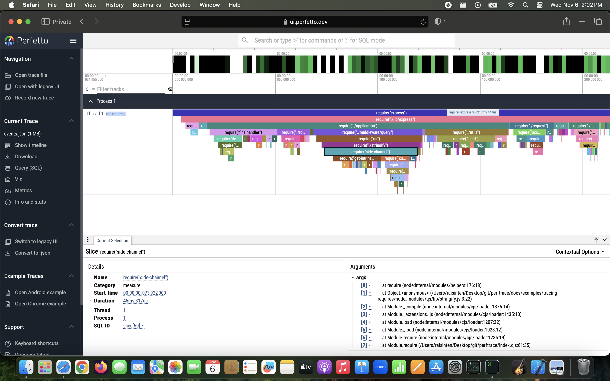

# perftrace

Record [`PerformanceEntry`](https://w3c.github.io/performance-timeline/#dom-performanceentry) objects from [Node.js](https://nodejs.org/api/perf_hooks.html) and the [Web](https://w3c.github.io/performance-timeline) in the [Trace Event Format](https://docs.google.com/document/d/1CvAClvFfyA5R-PhYUmn5OOQtYMH4h6I0nSsKchNAySU/preview), so that it can be visualized on <https://ui.perfetto.dev> like this!



The code for this example is available [here](docs/examples/tracing-requires).


The code for this example is available [here](docs/examples/client-side-use-on-web-browser).

Check out <a href="https://dev.to/raisinten/visualize-performance-issues-in-your-javascript-application-4cnc">the blog </a>!

## Install

To install via [NPM](https://www.npmjs.com/package/perftrace), run:

```
npm i perftrace
```

Alternatively, you can use it in vanilla JS, without any bundler, by using a CDN or static hosting. For example, using ES Modules, you can import the library with:

```html
<script type="module">
  import { TraceEvents } from "https://cdn.jsdelivr.net/npm/perftrace/index.mjs";
</script>
```

## Usage


```js
const { TraceEvents, trackRequires } = require('perftrace');
const { writeFileSync } = require('fs');

const traceEvents = new TraceEvents();

// Writes the performance traces in the "events.json" file during process exit.
process.on("beforeExit", () => {
  const events = traceEvents.getEvents();
  traceEvents.destroy();
  writeFileSync("events.json", JSON.stringify(events));
});

// Enables tracking require() calls.
trackRequires(true, { trackSource: true });

// The assert module takes milliseconds to load, so it would be distinctly
// visible in the performance trace.
const assert = require('assert');

const { performance } = require("node:perf_hooks");

// This is tracing an async setTimeout event which is interlaced with
// repeating setInterval events.

performance.mark("Timeout mark"); // marks the beginning of the timeout trace
setTimeout(() => {
  performance.measure("Timeout", "Timeout mark"); // marks the ending of the timeout trace
}, 20);

let id = 0;
performance.mark(`Interval mark ${id}`); // marks the beginning of the first interval trace
setInterval(function () {
  performance.measure(`Interval ${id}`, `Interval mark ${id}`); // marks the ending of the current interval trace
  ++id;
  // The intervals should go up to 3 counts only.
  if (id === 3) {
    this.close();
  }
  performance.mark(`Interval mark ${id}`); // marks the beginning of the next interval trace
}, 5);
```

After running this script with `node filename.js`, open the generated `events.json` file on <https://ui.perfetto.dev>.

Check out the [API documentation](docs/api) and the [code examples](docs/examples) for details.

## License

This project is available under the [MIT license](https://opensource.org/license/MIT). See [LICENSE](LICENSE) for the full license text.
