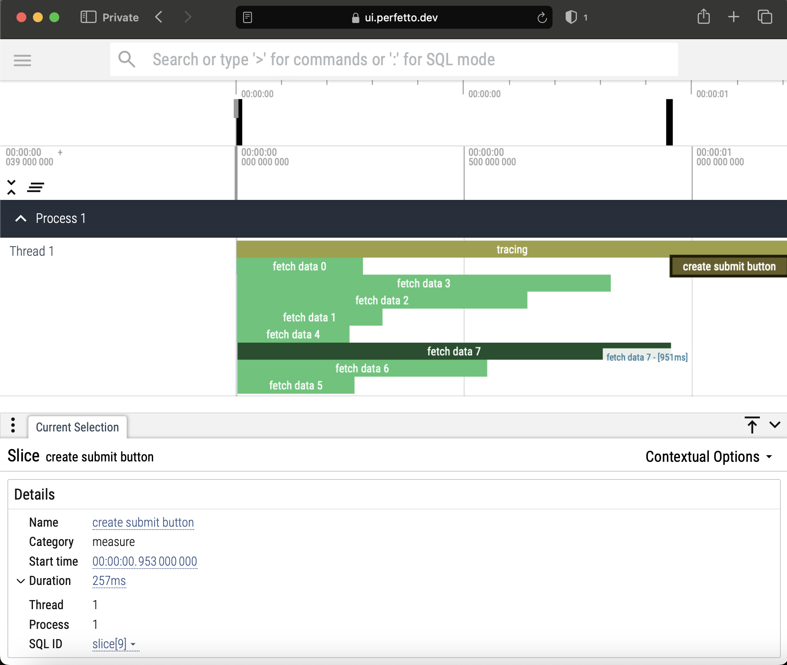

# Client-side use on Web Browser

## Server

The [`server.js`](server.js) Node.js program serves the files in the current directory and also serves the `perfetto` module from [`../../../index.mjs`](../../../index.mjs).

It also exposes the following endpoints:

- `/api/perftrace` (`POST`) - Reads the performance trace from the HTTP request body, writes it to a file and closes the server
- `/api/data[0-7]` (`GET`) - Serves `{"text": "<text-to-display-by-the-client>"}` after an artificial delay
- `/api/submit` (`GET`) - Serves `{"data": "<submission-button-text>"}` after an artificial delay

## Client

The `perftrace.mjs` module is `import`ed in (only works here because the server is designed to serve the file with this name):

https://github.com/RaisinTen/perftrace/blob/fbb0d21f13329eee9912373482e7821f61441621/docs/examples/client-side-use-on-web-browser/index.mjs#L1

A new `TraceEvents` object is created in:

https://github.com/RaisinTen/perftrace/blob/fbb0d21f13329eee9912373482e7821f61441621/docs/examples/client-side-use-on-web-browser/index.mjs#L4

The client displays a list of loader animations while fetching the data from the `/api/data[0-7]` endpoint in parallel and display those in:

https://github.com/RaisinTen/perftrace/blob/fbb0d21f13329eee9912373482e7821f61441621/docs/examples/client-side-use-on-web-browser/index.mjs#L10-L24

The loads are measured using the Performance Timeline APIs:

```js
performance.mark("before");
// code to measure
performance.measure("after", "before");
```

Once the data is fully loaded, a button is displayed, clicking which, sends the performance trace to the `/api/perftrace` endpoint which causes the server to write the performance trace to a file and shut down:

https://github.com/RaisinTen/perftrace/blob/fbb0d21f13329eee9912373482e7821f61441621/docs/examples/client-side-use-on-web-browser/index.mjs#L47-L61

After running `node server.js`, opening <http://localhost:8080> in your browser and clicking the `Submit trace` button, the generated `events.json` file can be opened on <https://ui.perfetto.dev> for visualization:



Here's a demo:


